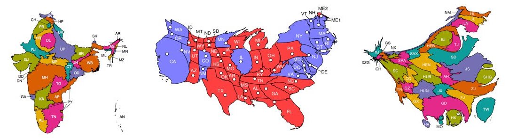
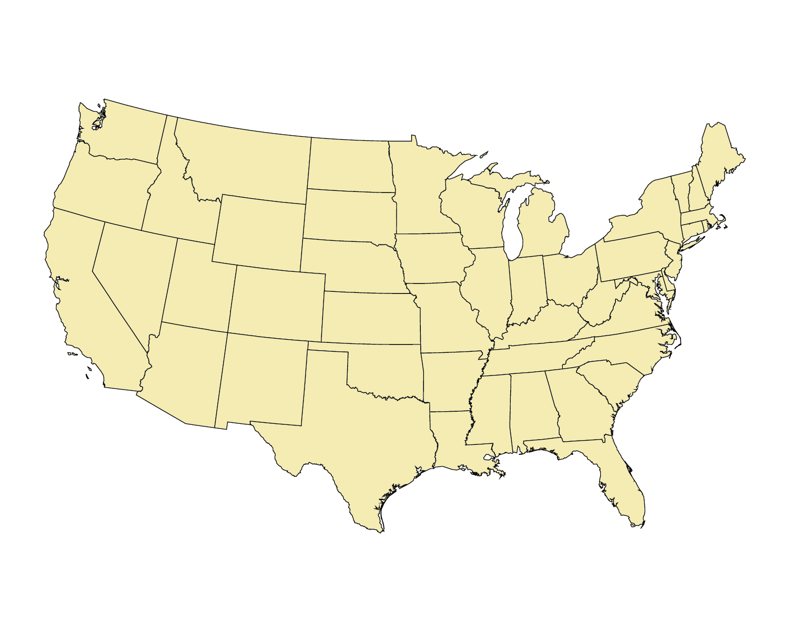
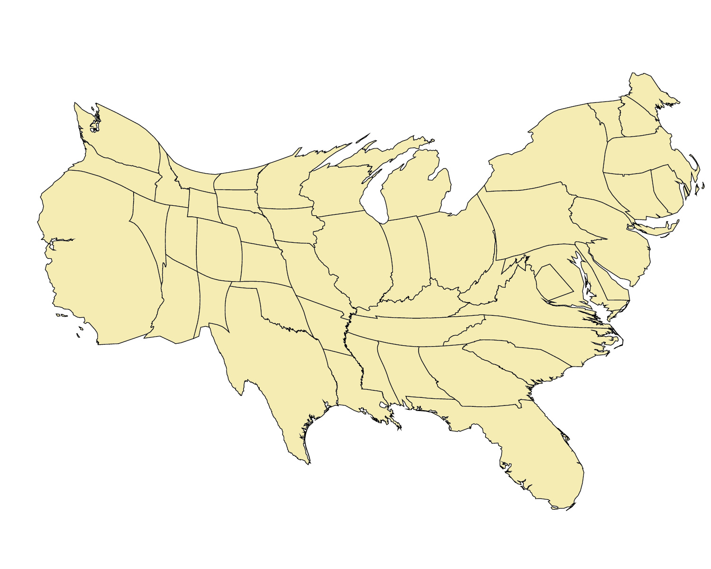

# Flow-Based Cartogram Generator
Cartogram generator in C++

<p align="center">


</p>

<p align="center">

</p>

## Table Of Contents
- [Introduction](#introduction)
- [Input data format](#input-data-format)
- [Compiling](#compiling)
<!-- - [Static Build on Ubuntu (needed for deployment on AWS Lambda)](#static-build-on-ubuntu-needed-for-deployment-on-aws-lambda) -->
- [Running the cartogram generator](#running-the-cartogram-generator)
  <!-- * [Processing Your Map](#processing-your-map-geojson) -->
  <!-- * [Examples](#examples) -->
  * [Options](#options)
<!-- - [Troubleshooting](#troubleshooting) -->

## Introduction
We present a fast <a href="https://en.wikipedia.org/wiki/Cartogram" target="\_blank" title="What are Cartograms?">cartogram</a> generator written in C++, inspired by the original C version. It uses the flow-based algorithm devised by <a href="https://doi.org/10.1073/pnas.1712674115" target="\_blank">Gastner, Seguy & More</a>.

This readme explains how to set up and use this software.
<!-- Check whether citation needed -->
<!-- In doing so, it uses data from the 2016 United States presidential election.
These data are included in the repository.
We also include the data for India and China shown in the paper cited below. -->

**Note:** Any images generated using this software should be referenced to:

Gastner, M., Seguy, V., & More, P. (2018). Fast flow-based algorithm for creating density-equalizing map projections. *Proceedings of the National Academy of Sciences USA*, **115**:E2156-E2164.

**BibTeX Entry:**

```
@article{gastner_seguy_more_2018,
	title={Fast flow-based algorithm for creating density-equalizing map projections},
	author={Gastner, Michael T. and Seguy, Vivien and More, Pratyush},
	DOI={10.1073/pnas.1712674115},
	journal={Proceedings of the National Academy of Sciences of the United States of America},
	year={2018},
	volume = {115},
	number = {10},
	pages = {E2156--E2164}
}
```

## Input data format
The cartogram generator expects two input files.

1. a '.geojson' file containing the cartesian coordinates for the map regions under consideration. For example, for the population data we provide `belgium.geojson` (in the `sample_data` folder) which includes the coordinates for the boundaries of the different provinces of the Belgium.

<!-- Add instructions for generating CSV -->
2. a '.csv' file containing the data (such as population) for each region, according to which these will be scaled. For the Belgium we provide `belgium_population2019.csv` (in the `sample_data` folder) which provides the population for each province. You may also chose to generate the csv file based on your GeoJson file will.

The `.csv` file should be in the following format:

| NAME_1        | Data (eg: Population)| Color   | Inset |
| :------------ |:---------------------| :-------| :---  |
| Bruxelles     | 1208542              | #e74c3c | T     |
| Vlaanderen    | 6589069              | #f1c40f | C     |
| Wallonie      | 3633795              | #34495e | B     |

- `NAME_1` should be the same as the identifying property's name in the GeoJSON. The rows should also have the same data as is present in the identifying property.
- `Data` contains the data you would like your cartogram to based on.
- `Color` is the color you would like the geographic region to be. Only include this if you would like to manually color the geographic regions. Otherwise, if possible, regions will be automatically colored with the gaurantee that no two bordering regions have the same color.
- `Inset` is which inset you would like your geographic region to be in. Only include this column  Options include, C (center, mandatory), T (top), L (left), B (bottom), R (right).

**Note: Please name the headers appropriately so that the CSV parser can detect the information a particular column is supposed to convey**

Colors may be represented in the following manner:
1. `cornflowerblue`: html color codes supported by `CSS3` (case-insensitive), full list of supported colors may be found in the "Extended colors" section of [web colors](https://en.wikipedia.org/wiki/Web_colors).
2. `"rgb(255, 0, 120)"` or `rgb(255 0 120)` or `"255, 0, 120"` or `255 0 120`: red, green and blue values out of 255
3. `#e74c3c`: hex code of color, must start with `#`

## Compiling

### Installing Dependencies on Ubuntu

#### Installing nlohmann's JSON parser
1. Go to https://github.com/nlohmann/json
2. Click on "Code" -> "Download Zip"
3. Go to Downloads folder
4. Unzip the file you just installed (you can use the `unzip` command)
5. Go into the newly created unzipped folder json-develop (you can use the `cd` command)
6. `cmake .`
7. `make`
8. `sudo make install`

#### Installing CGAL

[CGAL Homepage](https://www.cgal.org/)

`sudo apt-get install libcgal-dev`

#### Installing OpenMP

[OpenMP Homepage](https://www.openmp.org/)

`sudo apt-get install libomp-dev`


#### Installing FFTW3
1. Go to [FFTW's website](http://www.fftw.org/download.html "FFTW Downloads Page").
2. Install the latest version of FFTW
3. Unarchive the file with: `tar zxvf fftw-3.3.9.tar.gz`
4. Go to the directory with: `cd fftw-3.3.9`
5. `./configure`
6. `make`
7. `sudo make install`

---

<a name="docker_on_mac"></a>
### Setting up a Docker Ubuntu Container (with volume mounting) (Mac instructions)

1. If you have not already, download Docker Desktop from https://www.docker.com/products/docker-desktop.

2. Start Docker Desktop.

3. Change directories to your desired folder. (`vm` stands for "volume mount")

```
$ cd ~
$ mkdir cartogram_cpp_docker_vm
$ cd cartogram_cpp_docker_vm/
```

4. Pull the Ubuntu Docker image.

```
/cartogram_cpp_docker_vm$ docker pull ubuntu
```

5. View your Docker images.
```
/cartogram_cpp_docker_vm$ docker image ls
```

6. Create a container named `ubuntu-cartogram_cpp_vm` based on the Ubuntu image. The `-i` flag allows for an interactive container, the `-t` flag allows for terminal support within the container, and the `-v` flag allows for volume mounting.

`"$(pwd)":/home` allows for the localhost present working directory (`cartogram_cpp_docker_vm/`) to sync with the Docker container `home/` directory (for example).

Thus, any file you create in your localhost `cartogram_cpp_docker_vm/` directory will also appear in your Docker container `home/` directory, and vice versa.
```
/cartogram_cpp_docker_vm$ docker create  -it --name=ubuntu-cartogram_cpp_vm -v "$(pwd)":/home ubuntu bash
```

7. View your Docker containers and their relevant information. The `-a` flag means "all" and the `-s` flag means "size".
```
/cartogram_cpp_docker_vm$ docker ps -as
```

8. Start the `ubuntu-cartogram_cpp_vm` container. You will enter the root directory of this Ubuntu container in an environment where you can run your normal terminal commands (e.g., `cd`, `cp`, `mv` `pwd`).
```
/cartogram_cpp_docker_vm$ docker start -i ubuntu-cartogram_cpp_vm
```

9. To start a second (or third, fourth, etc.) terminal window in this container, open a new terminal tab and run the following command.
```
/cartogram_cpp_docker_vm$ docker exec -it ubuntu-cartogram_cpp_vm bash
```

10. To exit the container, run the following command.
```
root@<number>:/# exit
```
11. Start the container and install the necessary dependencies for cartogram_cpp.
```
/cartogram_cpp_docker_vm$ docker start -i ubuntu-cartogram_cpp_vm
root@<number>:/#
root@<number>:/# apt-get update
root@<number>:/# apt-get install sudo git vim cmake build-essential llvm libboost-all-dev g++-10 libcgal-dev libomp-dev
```

12. Download and copy the nlohmann JSON parser library to your localhost `cartogram_cpp_docker_vm/` directory.
    1. Go to https://github.com/nlohmann/json
    2. Click on "Code" -> "Download Zip"
    3. Go to your Downloads folder.
    4. Move the downloaded file from your Downloads folder to `cartogram_cpp_docker_vm/`.

13. To install nlohmann's JSON parser library, go back to your Ubuntu container terminal window and run the following commands.
```
root@<number>:/# cd home/json-develop/
root@<number>:/home/json-develop# cmake .
root@<number>:/home/json-develop# make
root@<number>:/home/json-develop# make install
```

14. Download and copy the FFTW library to your localhost `cartogram_cpp_docker_vm/` directory.
    1. Go to [FFTW's website](http://www.fftw.org/download.html "FFTW Downloads Page").
    2. Install the latest version of FFTW (http)
    3. Go to Downloads folder
    4. Move the downloaded file from the Downloads folder to `cartogram_cpp_docker_vm/`.

15. To unarchive and install the fftw3 library, go back to your Ubuntu container terminal window and run the following commands.
```
root@<number>:/# cd home/
root@<number>:/home# tar -xf fftw-3.3.9.tar
root@<number>:/home# rm fftw-3.3.9.tar
root@<number>:/home# cd fftw-3.3.9
root@<number>:/home/fftw-3.3.9# ./configure
root@<number>:/home/fftw-3.3.9# make
root@<number>:/home/fftw-3.3.9# sudo make install
```

16. In your localhost `cartogram_cpp_docker_vm/` directory, clone the `cartogram_cpp` repository.
```
/cartogram_cpp_docker_vm$ git clone git@github.com:mgastner/cartogram_cpp.git
```

17. In your Docker container, compile and execute the files and begin developing as per normal.
```
root@<number>:/# cd home/cartogram_cpp/build/
root@<number>:/home/cartogram_cpp/build# cmake .
root@<number>:/home/cartogram_cpp/build# make
root@<number>:/home/cartogram_cpp/build# ./cartogram -h
```

Again, the changes you make in your localhost `cartogram_cpp_docker_vm/` directory will be reflected in your Docker container `home/` directory and vice versa. This means that you may use the text editor of your choice to develop.

---

### Installing Dependencies on macOS

**As of 2021-May-21, these instructions do not work on all Macs. We are trying to find the bug. In the meantime, please follow the guide above, [Setting up a Docker Ubuntu Container](#docker_on_mac).**

**Please ensure you have `Homebrew` installed. You may find instruction on [Homebrew's website](https://brew.sh "Homebrew Home Page") for the same.**

#### Installing nlohmann's JSON parser

[nlohmann's GitHub Page](https://github.com/nlohmann/json)

`brew install nlohmann-json`


#### Installing CGAL

[CGAL Homepage](https://www.cgal.org/)

`brew install cgal`

#### Installing OpenMP

[OpenMP Homepage](https://www.openmp.org/)

`brew install libomp`

#### Installing LLVM Compilers

[LLVM Homepage](https://llvm.org)

`brew install llvm`

#### Installing FFTW3

[FFTW Homepage](http://www.fftw.org)

`brew install fftw`

#### Alternatively, install all, except nlhomann's JSON parser, at once:

`brew install fftw llvm libomp cgal nlohmann-json`

### Building and running (Ubuntu or macOS)

1. `cd ./build`
2. `cmake .`
3. `make`

You can run: `./cartogram` in the `build directory` to confirm that the build was successful.

```
$ ./cartogram
Options:
  -h [ --help ]                         Help screen
  -g [ --geometry ] arg                 GeoJSON file
  -v [ --visual_variable_file ] arg     CSV file with ID, area, and
                                        (optionally) colour
  -s [ --output_to_stdout ] [=arg(=1)] (=0)
                                        Output GeoJSON to stdout
  -q [ --output_equal_area ] [=arg(=1)] (=0)
                                        Output equal area GeoJSON
  -m [ --make_csv ] [=arg(=1)] (=0)     Boolean: create CSV file from the
                                        GeoJSON passed to the -g flag?
  -i [ --id ] arg                       Column name for IDs of geographic
                                        divisions (default: 1st CSV column)
  -a [ --area ] arg                     Column name for target areas (default:
                                        2nd CSV column)
  -c [ --color ] arg                    Column name for colors (default:
                                        "Color" or "Colour")
  -n [ --inset ] arg                    Column name for insets (default:
                                        "Inset")
  -l [ --long_grid_side_length ] arg    Number of grid cells along longer
                                        Cartesian coordinate axis
  -w [ --world ] [=arg(=1)] (=0)        Boolean: is input a world map in
                                        longitude-latitude format?
  -e [ --polygons_to_eps ] [=arg(=1)] (=0)
                                        Boolean: make EPS image of input and
                                        output?
  -d [ --density_to_eps ] [=arg(=1)] (=0)
                                        Boolean: make EPS images
                                        *_density_*.eps?
```

<!-- **Note:** If you run into issues, look at the [**Troubleshooting**](#troubleshooting) section below. -->
## Running the cartogram generator

To generate a cartogram, you need a map and the associated statistical data you want to visualize. The cartogram generator accepts maps in GeoJSON and statistical data in CSV format. To generate a cartogram, you need to:

Once you have your GeoJSON and CSV file with the data you want to visualize, you can run the following command to generate a cartogram:

```
./cartogram -g your-geojson-file.geojson -v your-csv-file.csv`
```

- The `-g` flag accepts a GeoJSON or JSON file, in the standard GeoJSON format.
- The `-v` flag accepts a .csv file with your target areas data.


The generated cartogram will be saved in the same format as the map input in the current working directory with the filename:

- `cartogram.json`, if the input map is in GeoJSON format

<!-- ### Examples

For the 2016 US presidential election data, navigate to the `data/` directory, and run the following command. Note that the sample data has **already been processed** using `cartogram -p`
```
cartogram -g usa_contiguous_arcgis.json -a usa_contiguous_electors.csv
```

For India and China GDP cartograms, run:

```
cartogram -g india_noLD_conic.gen -a india_gdp.dat
```

```
cartogram -g china_withSARandTWN_conic.gen -a china_gdp.dat
```

If you supply the **-e** option, you should see two generated files:

- `map.eps` shows the original map
- `cartogram.eps` shows the generated cartogram.

On macOS, open using
```
open <filename>.eps
```
On Linux, open using
```
evince <filename>.eps
```
Replace `<filename>` with the name of the file (`map` or `cartogram`) you wish to open.

For our example, `map.eps` should look as follows:

<p align="center">

</p>

And here is how `cartogram.eps` should look like:

<p align="center">

</p> -->
### Options

**-g**<br/>
> Location of the .geojson file for the original map

**-v**<br/>
> Location of the visual variable file (.csv).

**-s**<br/>
> Output the final cartogram GeoJSON file to `stdout`.

**-q**<br/>
> Output the final cartogram in equal area (transformed) rather than latitude/longitude.

**-m**<br/>
> Make a CSV from the given GeoJSON file. Cannot be used with -v.

**-i**<br/>
> Enter a custom column name for the IDs of the geographic divisions (defaults to first column in CSV)

**-a**<br/>
> Enter a custom column name for the target areas of the geographic divisions (defaults to second column in CSV)

**-c**<br/>
> Enter a custom column name for the colors of the geographic divisions (defaults to first column with header "Color" or "Colour" in CSV)

**-n**<br/>
> Enter a custom column name for the inset of the geographic divisions (defaults to first column with header "Inset" in CSV)

**-l**<br/>
> Number of grid cells you want along the longer cartesian coordinate axis. More will lead to a slower time, but may result in marginally more accuracy. You may increase this number if the generator spits out errors.

**-w**<br/>
> Calculate world cartogram and assume input coordinates are longitude/latitude

**-e**<br/>
> Output an EPS file of the original map and the final cartogram

**-d**<br/>
> Output an EPS file of the each step of densification process (`density_[STEP].eps`)

<!-- See whether section is needed -->
<!-- ## Troubleshooting
In case you run into problems while building the generator using the automated script, you could try manually carrying out some of the steps.

#### macOS
1. Install fftw and gcc.
```
$ brew install fftw
$ brew install gcc
```
2. Note down the version of `gcc` installed. For example, if `gcc-8.1.0` is installed, your version would be `8` (not 8.1.0).


3. Run autogen and configure,  pass it the compiler information
```
$ ./autogen.sh
$ CC=gcc-[your-version-number] ./configure
```

4. Run make
```
$ make
```

#### Ubuntu/Debian Linux
1. Make sure everything is up to date. Then install fftw and gcc.
```
sudo apt-get update
sudo apt-get install libfftw3-3 libfftw3-dev
sudo apt-get install build-essential
```

2. Make sure you are in the root directory, and then run the remaining steps.
```
$ ./configure && make
```

#### Error (macOS): Don't understand 'm' flag!

If you see the following line in your output, you may want to take a look at <a href="https://github.com/dmlc/xgboost/issues/1945" target="\_blank">this solution</a>.
```
FATAL:/opt/local/bin/../libexec/as/x86_64/as: I don't understand 'm' flag!
``` -->
